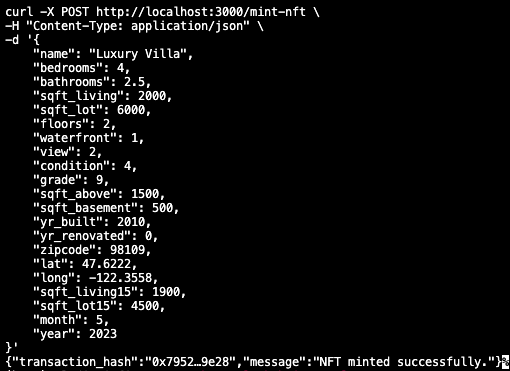

# NFT-House-Valuation-Decentralized-Platform

## ⚧ Work in Progress (WIP) ⚧

This project is currently under active development. Some features may not be fully implemented or are subject to change. Contributions and suggestions are welcome!

## Intro

This repository demonstrates how to create a decentralized platform for minting NFTs based on real estate data. It combines **machine learning** for house price prediction, a **Rust backend** for API handling, and a **smart contract** deployed on Ethereum for minting and managing NFTs.

## Table of Contents

- [Introduction](#introduction)
- [Features](#features)
- [Requirements](#requirements)
- [Installation](#installation)
- [Environment Variables](#environment-variables)
- [Usage](#usage)
  - [Mint an NFT](#4-mint-an-nft)
  - [Get Metadata](#get-metadata)
- [Project Structure](#project-structure)
- [Commands](#commands)
- [Contributing](#contributing)
- [License](#license)

## Introduction

The NFT-House-Valuation-Platform enables users to input house data, generate a predicted price using a machine learning model, and mint an NFT that encapsulates this information as metadata. The NFTs adhere to the **ERC-721 standard**, making them compatible with platforms like OpenSea.

## Features

- **Machine Learning Integration**: Predict house prices using a pre-trained ML model in Python.
- **Rust Backend**: Handles API requests, interacts with the Python model, and communicates with the Ethereum blockchain.
- **ERC-721 NFT**: Mint NFTs with detailed house information stored as metadata.
- **Metadata Updates**: Modify NFT metadata post-minting.
- **OpenSea Compatibility**: NFTs are visible and accessible on OpenSea.

## Requirements

Before starting, ensure you have the following installed on your system:

- **Python 3.8+** with the following libraries:
  - Flask
  - TensorFlow
  - Joblib
  - Pandas
- **Rust** (latest stable version): [Install Rust](https://www.rust-lang.org/tools/install)
- **Node.js** and **npm** for Hardhat:
  ```bash
  sudo apt install nodejs npm
  ```
- **MetaMask Wallet** with some ETH on the Goerli testnet.
- **Alchemy or Infura Account** for Ethereum RPC access.

---

## Installation

### 1. Clone the Repository
```bash
git clone https://github.com/eludius18/nft-house-valuation-platform.git
cd nft-house-valuation-platform
```

### 2. Set Up Environment Variables
This project requires `.env` files for sensitive configurations in the `blockchain` and `rust_backend` directories. Example `.env` files are provided. To set them up:

1. **Copy the example `.env` files**:
   ```bash
   cp blockchain/.env.example blockchain/.env
   cp rust_backend/.env.example rust_backend/.env
   ```

2. **Fill in the `.env` files**:
   Open each `.env` file and replace `<PLACEHOLDER>` values with the correct credentials.

   #### **`blockchain/.env`**
   ```env
   ALCHEMY_API_KEY=<your_alchemy_api_key>
   CHAIN_ID=31337
   PRIVATE_KEY=<your_private_key>
   ```

   #### **`rust_backend/.env`**
   ```env
   ALCHEMY_URL=http://127.0.0.1:8545
   CHAIN_ID=31337
   PRIVATE_KEY=<your_private_key>
   CONTRACT_ADDRESS=<deployed_contract_address>
   ```

3. **Do not commit `.env` files to version control**:
   These files are included in `.gitignore` to prevent accidental exposure of sensitive information.

### 3. Set Up the Python Model
```bash
cd machine_learning
pip3 install -r requirements.txt
```
Place your pre-trained model (`house_price_model.keras`) and scaler (`scaler.save`) in the `machine_learning/` directory.

### 4. Set Up the Rust Backend
```bash
cd ../rust_backend
cargo build
```

### 5. Set Up Hardhat
```bash
cd ../blockchain
npm install --save-dev @openzeppelin/contracts @nomiclabs/hardhat-ethers ethers
```

If you want to fork the Ethereum mainnet using Alchemy, follow these steps:

1. Add your Alchemy API key to the `blockchain/.env` file:
   ```env
   ALCHEMY_API_KEY=<your_alchemy_api_key>
   PRIVATE_KEY=<your_private_key>
   CHAIN_ID=1
   ```

2. Start Hardhat Node:
   ```bash
   npx hardhat node --fork https://eth-mainnet.alchemyapi.io/v2/<your_alchemy_api_key>
   ```

---

## Usage

### 1. Start the Python Model
```bash
cd machine_learning
python3 main.py
```

### 2. Deploy the Smart Contract
1. Navigate to the `blockchain/` directory.
2. Deploy the smart contract:
   ```bash
   npx hardhat run scripts/deploy.ts --network localhost
   ```
3. Copy the deployed contract address into the `CONTRACT_ADDRESS` field in the `rust_backend/.env` file.

### 3. Start the Rust Backend
```bash
cd rust_backend
cargo run
```

### 4. Mint an NFT
Send a POST request to the backend:
```bash
curl -X POST http://localhost:3000/mint-nft \
-H "Content-Type: application/json" \
-d '{
    "name": "Luxury Villa",
    "bedrooms": 4,
    "bathrooms": 2.5,
    "sqft_living": 2000,
    "sqft_lot": 6000,
    "floors": 2,
    "waterfront": 1,
    "view": 2,
    "condition": 4,
    "grade": 9,
    "sqft_above": 1500,
    "sqft_basement": 500,
    "yr_built": 2010,
    "yr_renovated": 0,
    "zipcode": 98109,
    "lat": 47.6222,
    "long": -122.3558,
    "sqft_living15": 1900,
    "sqft_lot15": 4500,
    "month": 5,
    "year": 2023
}'
```

### 5. Verify on OpenSea
Use the contract address and token ID to view the NFT on OpenSea:
```text
https://testnets.opensea.io/assets/goerli/<contract_address>/<token_id>
```

---

## Get Metadata

Retrieve metadata for a specific token by sending a GET request:
```bash
curl -X GET http://localhost:3000/get-metadata/<token_id>
```
Replace `<token_id>` with the ID of the token whose metadata you want to fetch.

---

## Project Structure

```
nft-house-valuation-platform/
├── machine_learning/        # Python house price prediction model
│   ├── main.py              # Python API for predictions
│   ├── utils.py             # Utility functions for ML
├── rust_backend/            # Rust backend
│   ├── src/
│   │   ├── main.rs          # Main Rust API
│   ├── .env.example         # Example environment variables
├── blockchain/              # Hardhat project for smart contracts
│   ├── contracts/
│   │   ├── RealEstateNFT.sol  # ERC-721 smart contract
│   ├── scripts/
│   │   ├── deploy.ts        # Deployment script
│   ├── hardhat.config.ts    # Hardhat configuration
│   ├── .env.example         # Example environment variables
├── README.md                # Project documentation
```

---

## Commands

### Python Model
- Start the Python server:
  ```bash
  python main.py
  ```

### Rust Backend
- Build the Rust backend:
  ```bash
  cargo build
  ```
- Start the Rust server:
  ```bash
  cargo run
  ```

### Hardhat
- Compile the contract:
  ```bash
  npx hardhat compile
  ```
- Deploy the contract:
  ```bash
  npx hardhat run scripts/deploy.ts --network localhost
  ```

---

## Screenshot



## Contributing

Contributions are welcome! Please:
1. Fork the repository.
2. Create a new branch (`git checkout -b feature-name`).
3. Commit your changes (`git commit -m "Add feature"`).
4. Push to the branch (`git push origin feature-name`).
5. Open a pull request.

---

## License

This project is licensed under the MIT License. See the [LICENSE](LICENSE) file for details.